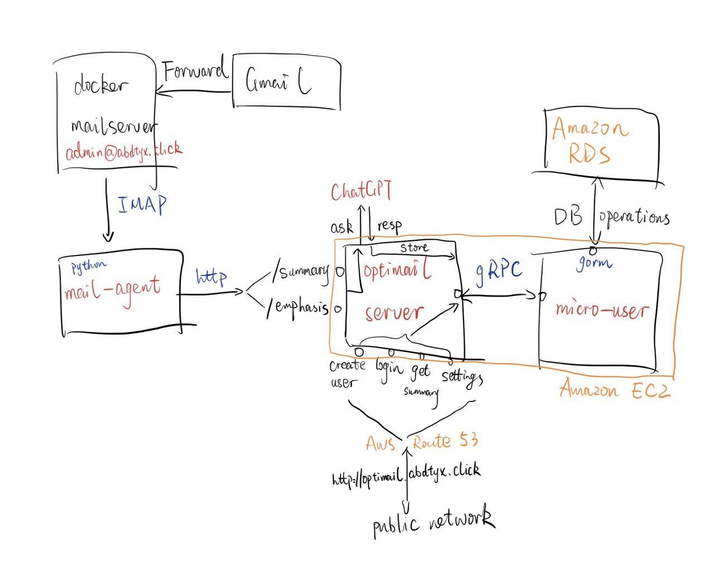

# Project Description

## Abstract

This is a simple web server that generates summary and emphasis content for users. By creating an account and set forwarding email address, users can get results in a few seconds. This project adopts micro service architecture. It has 3 components:  **mail agent**, **server** and **micro-user**. **Mail agent** uses IMAP to get email from docker-mailserver, and send them to the **server**. The **server** receives request and ask ChatGPT for answers. APIs are exposed by the **server**. Requests regarding with users are sent to **micro-user**. **Micro-user** handles database-related requests and interact with database.

## Overview



## Components

### docker-mailserver

An open-source mail server [docker-mailserver](https://github.com/docker-mailserver/docker-mailserver). To make it work, `hostname: mail.abdtyx.click` is changed in `compose.yaml` and a user `sudo docker exec -it mailserver setup email add admin@abdtyx.click` is added. Then I have to apply for a domain name on my own and set the following 6 records to receive emails from other mail server:
```
abdtyx.click					MX			10 mail.abdtyx.click
abdtyx.click					TXT			v=spf1 mx ~all
@.abdtyx.click					MX			10 mail.abdtyx.click
@.abdtyx.click					TXT			v=spf1 mx ~all
mail._domainkey.abdtyx.click	TXT			"v=DKIM1; h=sha256; k=rsa; p=MIIBIjANBgkqhkiG......"
mail.abdtyx.click				A			34.215.113.110
mail.abdtyx.click				PTR			34.215.113.110
```

### mail-agent

**Mail agent** polls the IMAP port (143) of mail server to get incoming emails from users. It then resolve the email to figure who sends the email and what is the email body. After that, it POST data to the `/summary` and `/emphasis` API of the **optimail server**.

### optimail-server

The **optimail server** stands as a gateway. Requests from mail agent and users hit this server on port 80. **optimail server** runs on **Amazon EC2**. Domain name `optimail.abdtx.click` points to its IPv4 address. **AWS Route 53** assigned the domain name.

It is implemented by Go using **[Gin](https://gin-gonic.com/)** Web Framework. Routes are registered in `main.go`. There are mainly 3 classes of routes: front-end webpage, email service, and database service. **mail agent** will call email service. Front-end webpage is called by the browser. Database service is called by the javascript code in the webpage.

Below is the structure of **optimail server**.

**config/**

Use `viper` to load `toml` config.

**gpt/**

Provide `Chat()` function to interact with ChatGPT.

**service/**

Gin handlers are implemented here. Handlers are: `Summarize`, `Emphasize`, `CreateUser`, `ChangePwd`, `Login`, `Logout`, `GetSettings`, `UpdateSettings`, `GetSummary`, `GetEmphasis`.

It also contains some helper functions to generate and verify JWT. I designed a simplified JWT to provide Integrity but no Authenticity. It simply appends a HMAC tag after the uuid and expire time. Tampering with the JWT will not work because HMAC is one-way and `jwtkey` is owned by the server securely.

**webpage/**

There are 7 pages in total. css and html are separated. The styles are inspired by GitHub's style. I just modified some html elements and wrote javascript code to interact with back-end server.

### micro-user

**micro user** communicates with **optimail server** using grpc protocol. It starts a grpc server on port 50051. **micro user** is deployed on **Amazon EC2**. Port 50051 is not exposed. Only **optimail server** has access to it. For database interactions, it uses [gorm](https://gorm.io/). Back-end database endpoint is on **Amazon RDS**.

Below is the structure of **micro user**.

**config/**

Use `viper` to load `toml` config.

**dto/**

Data Transfer Object. It uses protobuf to generate grpc data model and define the interfaces. Objects are defined in `user.proto`. `genpb.sh` will automatically generate grpc client for it, which is a lot of work if I implement it on my own.

**grpc/**

grpc implements the required interface of a grpc server so that dto is able to register itself. 

**model/**

**micro user** uses [gorm](https://gorm.io/) to interact with mysql database. gorm requires user to define their own models for retrieving data from database instead of using select query. 4 models (user, setting, summary, emphasis) are defined for 4 tables in the sql file.

**sql/**

sql files.

